Over the past week, I've been learning about [`k6`](https://github.com/grafana/k6) and how to use it. This post summarizes what I've learned with the goals of summarizing the topic, and allowing me to test my knowledge!

This is not a comprehensive post a won't cover **all** there is to learn about *load testing*, but I believe it's a good start :)

My learning resources have mostly been the excellent [k6-learn](https://github.com/grafana/k6-learn/) and the official [k6 docs](https://grafana.com/docs/k6/latest/).

## What is load testing? 🏋🏻️

**Load testing** is a branch of **performance testing**, which aims to measure *how well* a system works when dealing with a significant volume of tasks.

This quality can be *quantified* on several axes:
- **scalability**, adjusting to steadily increasing levels of demand;
- **elasticity**, conserving resources on lower demand;
- **availability**, uptime of each component;
- **reliability**, consistent behaviors in different environments;
- **resiliency**, gracefully withstanding the unexpected;
- **latency**, how fast a system handles requests.

These descriptions refer to the *result* of a performance test. Let's analyze what a test actually looks like.

## Writing a load test: model 📝

First, I think a good starting point is to understand the application that you want to test, and identify its **user flows** and **data flows**. For example: when load testing **Loki**, you might want to test the log ingestion capabilities, querying data, authentication, and how all those *flows* impact each other. This gives you a *model* of the application to use in load tests.

Second, after *modeling* the application, it's a good idea to **model the environment**. This means understanding the **shape** of traffic and users. For the previous **Loki** example, it could be:
- `x` log streams are sent to Loki every minute;
- `y` queries are executed in Loki for each log stream;
- `z` users try to unsuccessfully authenticate in total.

You should start out with very lenient numbers (low load, lax thresholds) and **explore** the real performance of your application, and to make sure the *flow* of your test works. You can then refine the exact numbers iteratively.

Third, choose what you want to verify. This depends not only on the application, but also on the information you want to gain from load testing. For **Loki**, you could look at the following *metrics*:
- average HTTP requests latency on push, which indicates whether Loki is struggling to ingest new data;
- average HTTP requests latency on query, which indicates whether a user would experience big delays when accessing data;
- 90th-percentile on several HTTP-related metrics, to verify reliability and resiliency.

Once you have an idea of all three, you can start writing some code!

## Writing a load test: vocabulary 📚

`k6` uses a set of terms that are extremely useful when talking about load testing.

### Parameters 📏

A `k6` script can be described by the following parameters:
- **virtual users** (or *VU*), independent and concurrent threads of execution;
- **iterations**, the total number of repetitions of the script;
- **throughput**, how much load is generated over time, measured either in `VU/s`, `requests/s`, or `iterations/s`;
- **user flows**, the actions carried out in the script;
- **load profile**, the shape of the traffic as a time series, including delays, ramping up or down, etc.;
- **duration**, the total runtime for a test.

Additionally, the load can be generated in a few ways:
- **protocol**, simulating underlying requests (like API calls)
- **browser**, simulating user interaction with the UI
- **hybrid**, a mixture of both.

Things that can be used inside a script are:
- **checks**, *to verify* something (like a server response); failing checks don't stop the test execution and don't affect `k6`'s exit code;
- **thresholds**, *to assert* some metrics are never invalidating some expression (the average request duration takes less than `x` seconds); if a threshold is *crossed* at any point, the test execution will terminate and `k6` will return with a non-zero exit code;
- **think time** is a pause in the script to simulate real-user delays in application usage; it's useful to achieve *realism* in tests, and to reduce high CPU usage (which should be kept below 80%).

### Scenarios 🖼️

A load test **scenario** pins a subset of test parameters to recreate a specific situation the application can be exposed to:
- **shakeout test** (or *smoke test*), to check for major issues:
	- few *VUs*, short *duration* (10 minutes), low load;
- **average load test**, for the typical production usage:
	- the *load profile* typically has a ramp-up, stable, and ramp-down periods;
	- typical duration is about 1 hour;
- **stress test**, for the highest *expected* load:
	- similar to *average load test*, but with a higher *throughput*;
- **soak test** (or *endurance test*), to check for problems that only appear during longer periods of time:
	- similar to *average load test*, but with a higher *duration*;
- **spike test**, for an *unexpected* massive increase of traffic:
	- the *load profile* has negligible ramp-up and ramp-down periods;
	- the *throughput* is higher than typical production usage;
	- typically involves one specific *user flow*;
- **breakpoint test**, to observe when performance starts to degrade:
	- the *load profile* only has ramp-up periods, often alternating with steady states;
	- builds confidence in what the system can handle;
	- exploratory test, produces a *measurement*, not a binary outcome.

### Mind Map 🗺️

To better understand these concepts and how they relate to each other, I made a mind map!

```mermaid
mindmap
  root((k6))
    ⚙️ **Performance Testing**<br/>Measuring how well a system works
        **Frontend**<br/>Testing the end-user experience of an application, often via browser
        **Backend**<br/>Testing the underlying application
            scalability["**Scalability**<br/>Adjusting to steadily increasing levels of demand"]
            elasticity["**Elasticity**<br/>Conserving resources on lower demand"]
            availability["**Availability**<br/>Uptime of each component"]
            reliability["**Reliability**<br/>Consistent behaviors in different environments"]
            resiliency["**Resiliency**<br/>Gracefully withstanding the unexpected"]
            latency["**Latency**<br/>How fast a system handles requests"]
    🏋 **Load Testing**<br/>Subset of *Performance Testing* dealing with heavier loads
        **Parameters**
            vus["**Virtual Users (VUs)**<br/>Independent and concurrent threads of execution"]
            iterations["**Iterations**<br/>Total number of repetitions of a script"]
            throughput["**Throughput**<br/>How much load is generated over time (VUs/s, iterations/s)"]
            user-flows["**User Flows**<br/>Actions carried out in a script"]
            load-profile["**Load Profile**<br/>Shape of the traffic as a time series, including delays, ramping up or down, etc."]
            duration["**Duration**<br/>The total runtime for a test"]
        **Scenarios**
            shakeout-test["**Shakeout Test (or Smoke Test)**<br/> Checks for major issues.<br/>Few *VUs*, short *duration* (10m), low load"]
            average-test["**Average Load Test**<br/>Typical production usage.<br/>*Load profile* has ramp-up, stable, and down periods; *duration* is typically 1h"]
                stress-test["**Stress Test**<br/>Highest *expected* load.<br/>Like an *average load test*, but with higher *throughput*"]
                soak-test["**Soak Test (or Endurance Test)**<br/>For problems that take long to appear.<br/>Like an *average load test*, but with higher *duration*"]
            spike-test["**Spike Test**<br/>*Unexpected* massive increase of traffic.<br/>Tiny ramp-up/down, high *throughput*, often one *user flow*"]
            breakpoint-test["**Breakpoint Test**<br/>Observe when performance degrades.<br/>*Only ramp-up/stable periods, exploratory test to measure how much a system can handle"]
    ✏️ **Script**
        check["**Check**<br/>Light assertions that don't block the execution"]
        thinktime["**Think Time**<br/>Pause in the script to simulate real-user delays in application usage"]
        thresholds["**Thresholds**<br/>Hard assertions that block the execution"]
        📜 **Test Results**
            **Execution Parameters**
                execution["*execution*<br/>Where scripts are executed (local, cloud)"]
                script["*script*<br/>Filename of the script"]
                output["*output*<br/>k6 output format (stdout, json, prometheus, etc.)"]
                scenario["*scenario*<br/>Subset of parameters describing a test"]
            consoleoutput["**Console Output**<br/>Results of the defined checks and *console.log()*"]
            **k6 built-in metrics**<br/>Useful for test analysis
                [*data_received* and *data_sent*<br/>Self-explanatory]
                [*http_req_\\**<br/>Metrics about different timings of HTTP requests]
                [*iteration_\\**<br/>Metrics about a single script repetition]
            [**Execution Summary**<br/>Overview of the test run]
```




## Writing a load test: code 💻

The example script from [k6's README](https://github.com/grafana/k6#example-script) is the following:

```javascript
import http from "k6/http";
import { check, sleep } from "k6";

// Test configuration
export const options = {
  thresholds: {
    // Assert that 99% of requests finish within 3000ms.
    http_req_duration: ["p(99) < 3000"],
  },
  // Ramp the number of virtual users up and down
  stages: [
    { duration: "30s", target: 15 },
    { duration: "1m", target: 15 },
    { duration: "20s", target: 0 },
  ],
};

// Simulated user behavior
export default function () {
  let res = http.get("https://quickpizza.grafana.com");
  // Validate response status
  check(res, { "status was 200": (r) => r.status == 200 });
  sleep(1); // Think time
}
```

I think the comments and the simplicity of the code make it pretty self-explanatory, so I don't really have anything to add. 🤷🏻

## Conclusions 🌸

Load testing is a huge field, and there's a lot to learn there. I hope this can be one piece of the puzzle in your journey towards learning about it! 🧩

